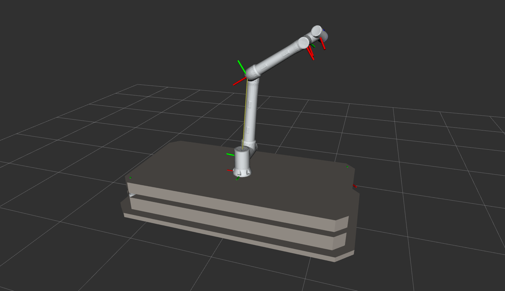

# ROS2-AMRwithCobot

Performing certain transfer operations with a collaborative robot (cobot) mounted on an autonomous mobile robot (AMR).

## Application Overview

This project integrates a Fairino collaborative robot with an autonomous mobile robot to perform transfer operations using ROS2. The system leverages the Fairino cobot for precise manipulation and the AMR for mobility.

### Application Image


## Fairino Cobot Resources

For detailed information and resources on the Fairino collaborative robot, refer to the following repository:
[Fairino Cobot Docker](https://github.com/mustafaktaas/Fairino-Cobot-Docker.git)

## Getting Started

To set up and run the project, use the following ROS2 commands:

### Run the Fairino Hardware Command Server
```bash
ros2 run fairino_hardware ros2_cmd_server
```

### Launch the Fairino Cobot Visualization
```bash
ros2 launch fairino_description display.launch.py
```

### Launch the SDV (AMR) Visualization
```bash
ros2 launch sdv_description display.launch.py
```

## Prerequisites
- ROS2 (Humble or later recommended)
- Docker (for Fairino Cobot dependencies, see the linked repository)
- Fairino cobot hardware or simulation setup
- AMR platform compatible with `sdv_description`

## Installation
1. Clone this repository:
   ```bash
   git clone <repository-url>
   ```
2. Build the ROS2 workspace:
   ```bash
   cd <workspace>
   colcon build
   source install/setup.bash
   ```
3. Follow the setup instructions in the [Fairino Cobot Docker repository](https://github.com/mustafaktaas/Fairino-Cobot-Docker.git) for cobot dependencies.

## Contributing
Contributions are welcome! Please open an issue or submit a pull request for any improvements or bug fixes.
